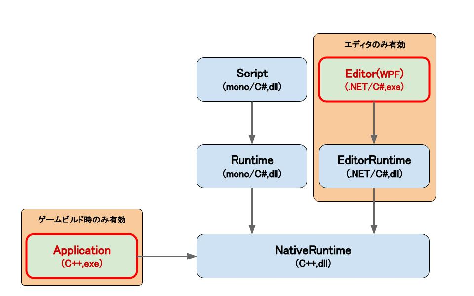

# MiyadaikuEngine1.0

コンポーネントシステムを備えた、自作のゲームエンジンです。\
ポートフォリオを兼ねて開発中です。（２０２２年７月中旬～）

# アーキテクチャ

現状のアーキテクチャの設計は下図、表の通りです。
ユーザはScript(C#)を定義します。

|  モジュール  |  概要  |
| ---- | ---- |
| Script | ユーザが定義する、コンポーネントスクリプトのアセンブリ。NativeRuntimeによってmono上で呼び出されます。 |
| Runtime | NativeRuntimeをmono上にラッピングして公開します。エンジン標準のコンポーネントもここで定義されます。 |
| NativeRuntime | C++で記述されます。各種APIの管理や、入出力、アセット管理などを行います。また、Runtimeとゲームオブジェクトやメモリの情報を共有し、それらをEditorRuntimeへ公開します。 |
| EditorRuntime | エディタにのみ含まれます。NativeRuntimeを .NET Framework上にラッピングして公開します。NativeRuntimeと通信し、エディタに必要な情報をやり取りします。 |
| Editor | エディタにのみ含まれます。exeファイルとして起動できるエディタをWPFで作成します。 |
| Application | ゲームビルド時のみ含まれます。NativeRuntimeを使って、ゲームの起動やゲームループを呼び出します。 |

# ロードマップ

おおよその実装予定です。\
適宜加筆修正します。

タスク管理用のTrelloはこちら \
https://trello.com/b/jDuAlxcO

|  項目名  |  進捗度  | 概要 |
| ---- | ---- | ---- |
|  WPFによるエディタGUI  |  5%  |   |
|  C#スクリプト  |  0%  | Monoを用いて実装予定です。  |
|  D3D11レンダラ  |  0%  | C++(Win32API)で実装予定。  |
|  D3D12レンダラ  |  0%  | 低優先度。C++(Win32API)で実装予定。  |
| オーディオ(XAudio) | 0% |  |
|  物理,コリジョン  |  0%  | PhysX採用？  |
|  Dear ImGui, ImGuizmo  |  0%  | デバッグ、仮のマニピュレータとして使用予定。  |
| 3Dモデル読み込み | 0% | Assimpを使用予定。|

