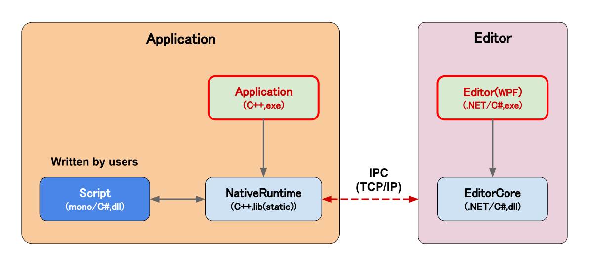

# Miyadaiku Engine 1.0

> **Note**  
> **本リポジトリは、開発の初期段階です。**\
> そのため、現在は実用するためには不足している機能があります。\
> 機能追加など長期的に開発を進めていく予定です。
> 
> **This repository is WIP and eary progress of develop.**\
> So, this has many lack critical features for now.\
> I'll develop in long term.

コンポーネントシステムを備えた、自作のゲームエンジンです。(WIP)\
ポートフォリオを兼ねて開発中です。（２０２２年７月中旬～）

Game engine that can be scripted in C#(mono).\
Under development for the portfolio. (from July 2022)

# 概要

**技術紹介＆ポートフォリオ（随時更新します）**  

[https://mewmew-tea.github.io/Portfolio/](https://mewmew-tea.github.io/Portfolio/)

**紹介動画（随時更新します）**  

[](https://youtu.be/_BmQGiO4Gko)

# How to build

現在はWindows(x64)のみの対応です。

## Requirements

- git
- Visual Studio 2022 or later
- cmake 3.22 or later
- git-lfs

## Clone and generate projects

リポジトリをClone、初期化してください。

```
git clone https://github.com/mewmew-tea/MiyadaikuEngine1.0
cd MiyadaikuEngine1.0
git submodule update --init
git lfs install
git lfs pull
```

テストを含まない場合： `Script/GenerateProjects.bat`をクリックしてください。\
テストを含む場合：`Script/GenerateProjects_Test.bat`をクリックしてください。

## Build

ルートディレクトリで以下のコマンドを実行して下さい。

```
cmake --build　build/
```

# アーキテクチャ

現状のアーキテクチャの設計は下図、表の通りです。
ユーザはScript(C#)を定義します。



|  モジュール  |  概要  |
| ---- | ---- |
| Script | ユーザが定義する、スクリプト（コンポーネント）のアセンブリ。NativeRuntimeによってmono上で呼び出されます。 |
| NativeRuntime | C++で記述されます。各種APIの管理や、入出力、アセット管理などを行います。また、Scriptを管理し、シーン等の情報を共有します。これらは、EditorRuntimeへプロセス間通信をして公開します。 |
| Application | C++で記述される実行ファイルです。NativeRuntimeを使って、ゲームの起動やゲームループを呼び出します。 |
| Editor | WPFを用いた、exeファイルとして起動できるエディタです。NativeRuntieとプロセス間通信をすることで、連携をします。 |
| EditorCore | エディタの基礎的なコントロールなどです。 |

# 特徴

- RHI(Render Hardware Interface)層を含む、マルチプラットフォームを見据えたレンダラ設計
- C#スクリプトシステム（mono）
- 別プロセスとして分離され、TCP/IPでプロセス間通信をするRuntime(Application)とEditor

# ロードマップ

おおよその実装予定です。\
適宜加筆修正します。

<!-- タスク管理用のTrelloはこちら \
https://trello.com/b/jDuAlxcO -->

|  項目名  |  進捗度  | 概要 |
| ---- | ---- | ---- |
|  エンジンコア  |  70%  | プラットフォーム機能、ファイルシステムなど  |
|  算術ライブラリ(C++)  |  90%  | C++のNaitiveRuntimeに含まれます。  |
|  算術ライブラリ(C# script)  |  50%  | C#のScript用。  |
|  D3D11レンダラ  |  30%  | C++(Win32API)  |
|  D3D12レンダラ  |  0%  | 低優先度。C++(Win32API)で実装予定。  |
|  C#スクリプトシステム  |  50%  | Monoを用いて実装予定。  |
|  WPFによるエディタGUI  |  15%  |   |
| アセットシステム | 0% |  |
| オーディオ(XAudio) | 0% |  |
|  物理,コリジョン  |  0%  | PhysX採用？  |
|  Dear ImGui, ImGuizmo  |  75%  | ImGui：おもにユーザー用、ImGuizmo：マニピュレータとして使用予定。  |
| 3Dモデル読み込み | 75% | Assimpを使用予定。|


