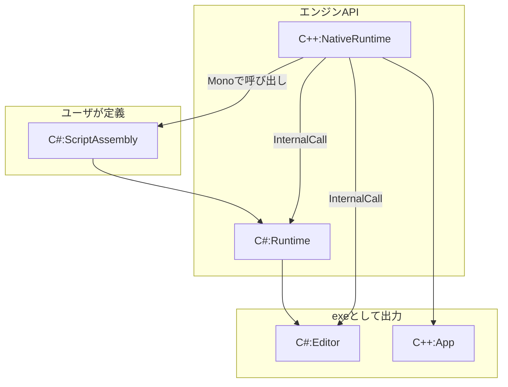

# MiyadaikuEngine1.0

コンポーネントシステムを備えた、自作のゲームエンジンです。\
ポートフォリオを兼ねて開発中です。（２０２２年７月中旬～）

# アーキテクチャ概要

現状でのアーキテクチャ設計は下図の通りです。\
C++で記述したNativeRuntimeがエンジンのコア機能などを持ち、それをC#で書かれたRuntimeモジュールがラッピングします。\
Editor(WPF)やユーザが定義するScriptAssemblyは、C#のみで記述します。

# ロードマップ

おおよその実装予定です。\
適宜加筆修正します。

タスク管理用のTrelloはこちら \
https://trello.com/b/jDuAlxcO

|  項目名  |  進捗度  | 概要 |
| ---- | ---- | ---- |
|  WPFによるエディタGUI  |  5%  |   |
|  C#スクリプト  |  0%  | Monoを用いて実装予定です。  |
|  D3D11レンダラ  |  0%  | C++(Win32API)で実装予定。  |
|  D3D12レンダラ  |  0%  | 低優先度。C++(Win32API)で実装予定。  |
| オーディオ(XAudio) | 0% |  |
|  物理,コリジョン  |  0%  | PhysX採用？  |
|  Dear ImGui, ImGuizmo  |  0%  | デバッグ、仮のマニピュレータとして使用予定。  |
| 3Dモデル読み込み | 0% | Assimpを使用予定。|

