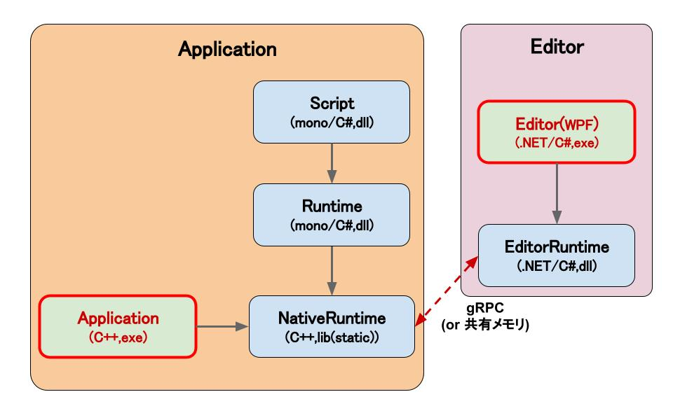

<!--  -->
# MiyadaikuEngine1.0

> **Note**
> **本リポジトリは、開発の初期段階です。**\
> 機能追加など長期的に開発を進めていく予定です。

コンポーネントシステムを備えた、自作のゲームエンジンです。(WIP)\
ポートフォリオを兼ねて開発中です。（２０２２年７月中旬～）

# How to build

現在はWindows(x64)のみの対応です。

## Requirements

- git
- Visual Studio 2022 or later
- cmake 3.22 or later

## Clone and generate projects

リポジトリをClone、Submoduleを取得してください。

```
git clone https://github.com/mewmew-tea/MiyadaikuEngine1.0
cd MiyadaikuEngine1.0
git submodule update --init
```

テストを含まない場合： `Script/GenerateProjects.bat`をクリックしてください。\
テストを含む場合：`Script/GenerateProjects_Test.bat`をクリックしてください。

## Build

ルートディレクトリで以下のコマンドを実行して下さい。

```
cmake --build　build/
```

# アーキテクチャ

現状のアーキテクチャの設計は下図、表の通りです。
ユーザはScript(C#)を定義します。



|  モジュール  |  概要  |
| ---- | ---- |
| Script | ユーザが定義する、コンポーネントスクリプトのアセンブリ。NativeRuntimeによってmono上で呼び出されます。 |
| Runtime | NativeRuntimeをmono上にラッピングして公開します。エンジン標準のコンポーネントもここで定義されます。 |
| NativeRuntime | C++で記述されます。各種APIの管理や、入出力、アセット管理などを行います。また、Runtimeとゲームオブジェクトやメモリの情報を共有し、それらをEditorRuntimeへ公開します。 |
| Application | C++で記述されます。NativeRuntimeを使って、ゲームの起動やゲームループを呼び出す実行ファイルです。 |
| EditorRuntime | エディタにのみ含まれます。NativeRuntimeのAPIを、 .NET Framework上にラッピングして公開します。NativeRuntimeと通信し、エディタに必要な情報や命令をやり取りします。 |
| Editor | エディタにのみ含まれます。WPFを用いた、exeファイルとして起動できるエディタです。 |

# 特徴

- RHI(Render Hardware Interface)層を含む、マルチプラットフォームを見据えたレンダラ設計

# ロードマップ

おおよその実装予定です。\
適宜加筆修正します。

<!-- タスク管理用のTrelloはこちら \
https://trello.com/b/jDuAlxcO -->

|  項目名  |  進捗度  | 概要 |
| ---- | ---- | ---- |
|  エンジンコア  |  70%  | プラットフォーム機能、ファイルシステムなど  |
|  算術ライブラリ  |  90%  | C++のNaitiveRuntimeに含まれます。  |
|  D3D11レンダラ  |  20%  | C++(Win32API)  |
|  D3D12レンダラ  |  0%  | 低優先度。C++(Win32API)で実装予定。  |
|  C#スクリプトシステム  |  30%  | Monoを用いて実装予定。  |
|  WPFによるエディタGUI  |  5%  |   |
| アセットシステム | 0% |  |
| オーディオ(XAudio) | 0% |  |
|  物理,コリジョン  |  0%  | PhysX採用？  |
|  Dear ImGui, ImGuizmo  |  0%  | デバッグ、仮のマニピュレータとして使用予定。  |
| 3Dモデル読み込み | 0% | Assimpを使用予定。|


